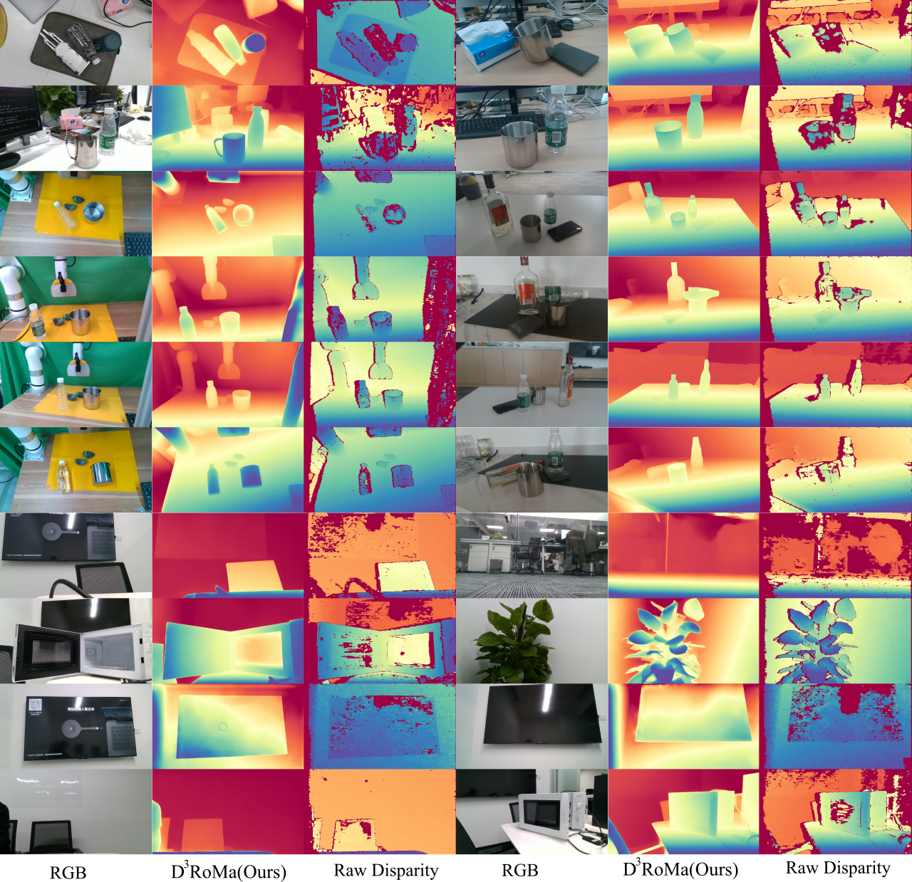

<h2 align="center">
  <b>D<sup>3</sup>RoMa: Disparity Diffusion-based Depth Sensing for Material-Agnostic Robotic Manipulation</b>

  <b><i>CoRL 2024, Munich, Germany.</i></b>


<div align="center">
    <a href="https://arxiv.org/abs/2409.14365" target="_blank">
    </a>
    <a href="https://pku-epic.github.io/D3RoMa/" target="_blank">
    </a>
    <a href="https://openreview.net/forum?id=7E3JAys1xO" target="_blank">
    </a>
</div>
</h2>

This is the official repository of [**D3RoMa: Disparity Diffusion-based Depth Sensing for Material-Agnostic Robotic Manipulation**](https://arxiv.org/abs/2409.14365).

For more information, please visit our [**project page**](https://pku-epic.github.io/D3RoMa/).

[Songlin Wei](https://songlin.github.io/),
[Haoran Geng](https://geng-haoran.github.io/),
[Jiayi Chen](https://jychen18.github.io/),
[Congyue Deng](https://cs.stanford.edu/~congyue/),
[Wenbo Cui](#),
[Chengyang Zhao](https://chengyzhao.github.io/),
[Xiaomeng Fang](#),
[Leonidas Guibas](https://geometry.stanford.edu/member/guibas/), and 
[He Wang](https://hughw19.github.io/)


 
## 💡 Updates (Jan 4, 2025)

 - [x] We just release new model variant (Cond. on RGB+Raw), please checkout the updated inference.py
 - [x] Traning protocols and datasets


Our method robustly predicts transparent (bottles) and specular (basin and cups) object depths in tabletop environments and beyond.



## INSTLLATION 
```
conda create --name d3roma python=3.8
conda activate d3roma

# install dependencies with pip
pip install torch==1.12.1+cu113 torchvision==0.13.1+cu113 torchaudio==0.12.1 --extra-index-url https://download.pytorch.org/whl/cu113
pip install huggingface_hub==0.24.5
pip install diffusers opencv-python scikit-image matplotlib transformers datasets accelerate tensorboard imageio open3d kornia
pip install hydra-core --upgrade
```


## DOWNLOAD PRE-TRAINED WEIGHT

+ For model variant: Cond. Left+Right+Raw [Google drive](https://drive.google.com/file/d/12BLB7mKDbLPhW2UuJSmYnwBFokOjDvC9/view?usp=sharing), [百度云](https://pan.baidu.com/s/1u7n4wstGpqwAswp8ZbTNlw?pwd=o9nk)
+ For model variant: Cond. RGB+Raw [Google drive](https://drive.google.com/file/d/1cTAUZ2lXBXe4-peHLUneJ6ufQTqFr6E9/view?usp=drive_link), [百度云](https://pan.baidu.com/s/1zWwdMQ2_6-CViaC2JUGsFA?pwd=bwwb)
```
# Download pretrained weigths from Google Drive
# Extract it under the project folder
```

## RUN INFERENCE
You can run the following script to test our model. We provided two variants `left+right+raw` for stereo cameras and `rgb+raw` for any RGBD cameras:
```
python inference.py
```
This will generate three files under folder `_output`: 

`_outputs.{variant}/pred.png`: the pseudo colored depth map

`_outputs.{variant}/pred.ply`: the pointcloud which ia obtained though back-projected the predicted depth

`_outputs.{variant}/raw.ply`: the pointcloud which ia obtained though back-projected the camera raw depth


## Training

#### 1. Preparing Datasets

All the datasets will be linked to folder `datasets`

+ Download [SceneFlow stereo](https://lmb.informatik.uni-freiburg.de/resources/datasets/SceneFlowDatasets.en.html) 

+ Download [DREDS](https://github.com/PKU-EPIC/DREDS#dataset)

+ Download [HISS](https://drive.google.com/drive/folders/1BTbiHWIM_zQC85pz-NMVnYBdZvt1oxaV?usp=sharing)

+ Download  [Clearpose](https://github.com/opipari/ClearPose)

Example datasets folder structure:

```
datasets
├── clearpose -> /raid/songlin/Data/clearpose
│   ├── clearpose_downsample_100
│   │   ├── downsample.py
│   │   ├── model
│   │   ├── set1
│   │   ├── ...
│   ├── metadata
│   │   ├── set1
│   │   ├── ...
│   ├── model
│   │   ├── 003_cracker_box
│   │   ├── ...
│   ├── set1
│   │   ├── scene1
│   │   ├── ...
│   ├── ...
├── DREDS
│   ├── test -> /raid/songlin/Data/DREDS_ECCV2022/DREDS-CatKnown/test
│   │   └── shapenet_generate_1216_val_novel
│   ├── test_std_catknown -> /raid/songlin/Data/DREDS_ECCV2022/STD-CatKnown
│   │   ├── test_0
│   │   ├── ...
│   ├── test_std_catnovel -> /raid/songlin/Data/DREDS_ECCV2022/STD-CatNovel
│   │   └── real_data_novel
│   ├── train -> /raid/songlin/Data/DREDS_ECCV2022/DREDS-CatKnown/train
│   │   ├── part0
│   │   ├── ...
│   └── val -> /raid/songlin/Data/DREDS_ECCV2022/DREDS-CatKnown/val
│       └── shapenet_generate_1216
├── HISS
│   ├── train -> /raid/songlin/Data/hssd-isaac-sim-100k
│   │   ├── 102344049
│   │   ├── 102344280
│   │   ├── 103997586_171030666
│   │   ├── 107734119_175999932
│   │   └── bad_his.txt
│   └── val -> /raid/songlin/Data/hssd-isaac-sim-300hq
│       ├── 102344049
│       ├── 102344280
│       ├── 103997586_171030666
│       ├── 107734119_175999932
│       ├── 300hq.tar.gz
│       ├── bad_his.txt
│       └── simulation2
├── sceneflow -> /raid/songlin/Data/sceneflow
│   ├── bad_sceneflow_test.txt
│   ├── bad_sceneflow_train.txt
│   ├── Driving
│   │   ├── disparity
│   │   ├── frames_cleanpass
│   │   ├── frames_finalpass
│   │   ├── raw_cleanpass
│   │   └── raw_finalpass
│   ├── FlyingThings3D
│   │   ├── disparity
│   │   ├── frames_cleanpass
│   │   ├── frames_finalpass
│   │   ├── raw_cleanpass
│   │   └── raw_finalpass
│   └── Monkaa
│       ├── disparity
│       ├── frames_cleanpass
│       ├── frames_finalpass
│       ├── raw_cleanpass
│       └── raw_finalpass
├── README.md
```

#### 2. Data Preprocessing - resize, compute raw disparity, and filter bad images

- We resize `DREDS` dataset from `1270x720` to `640x360`, and convert raw depth to raw disparity using resized resolutions.

- If the dataset does not provide **raw disparity**, we pre-compute them by running Stereo Matching algorithms:
```
# please make necessary changes to file paths, focal lengths and baselines etc.
# we adapted this file from DREDS.
python scripts/stereo_matching.py 
```

We also tried using [libSGM](https://github.com/fixstars/libSGM) to precompute disaprity maps for SceneFlow.
The precomputed raw disparities are put under `raw_cleanpass` and `raw_finalpass` with same sub-folder paths.
You can also download the [precomputed sceneflow raw disparities here](https://drive.google.com/file/d/1CZQvR-61IQ8o4n4ewNkVO9M3VCIIGHgr/view?usp=sharing).

- Sometimes the source stereo images are too challenging for computing raw disparities, so we filter them our during training.
We run the following scripts to filter out very bad raw disparities and exclude them in dataloader:

```
python scritps/check_sceneflow.py
python scritps/check_stereo.py
```

#### 3. Download pre-trained stable-diffusion

We use v-2.1 (resolution 768) version of stable diffusion.

Download [stablediffusion v2.1-768 checkpoints](https://huggingface.co/stabilityai/stable-diffusion-2-1/tree/main) and put in under `checkpoint/stablediffusion`

Example folder structure after downloaed (I download the checkpoint files manullay)
```
checkpoint
└── stable-diffusion -> /home/songlin/Projects/diff-stereo/checkpoint/stable-diffusion
    ├── feature_extractor
    │   └── preprocessor_config.json
    ├── model_index.json
    ├── scheduler
    │   └── scheduler_config.json
    ├── text_encoder
    │   ├── config.json
    │   └── model.safetensors
    ├── tokenizer
    │   ├── merges.txt
    │   ├── special_tokens_map.json
    │   ├── tokenizer_config.json
    │   └── vocab.json
    ├── unet
    │   ├── config.json
    │   └── diffusion_pytorch_model.safetensors
    ├── v2-1_768-nonema-pruned.safetensors
    └── vae
        ├── config.json
        └── diffusion_pytorch_model.safetensors

```

#### 4. Train

```
# Because we already downloaded StableDiffusion's pretrained weights
export HF_HUB_OFFLINE=True
```

We use huggingface accelerate and train on 8 A100-40G:
```
cd <Project Dir>
conda activate d3roma
accelerate config
```

We train the variant `left+right+raw` using datasets: `SceneFlow`, `DREDS`,  and `HISS`. This variant is suitable for working with Stereo cameras.
```
accelerate launch train.py \
  task=train_ldm_mixed_left+right+raw \
  task.tag=release \
  task.eval_num_batch=10 \
  task.val_every_global_steps=5000
```

We train the variant `rgb+raw` using datasets: `DREDS`, `HISS` and `ClearPose`. This variant is suitable for working with RGBD cameras.

```
accelerate launch train.py \
  task=train_ldm_mixed_rgb+raw \
  task.tag=release \
  task.eval_num_batch=10 \
  task.val_every_global_steps=5000
```

#### 5. Run tensorboard to monitor training process

```
tensorboard --logdir experiments --port 20000
```

##### 5. Distributed Evaluation

If you want to parallel evaluation on test datasets:
```
accelerate launch distributed_evaluate.py task=...
```

## Reprocuing results on in Paper
```
accelerate launch train.py task=train_dreds_reprod

accelerate launch train.py task=train_clearpose

accelerate launch train.py task=train_syntodd_rgbd

accelerate launch train.py task=train_sceneflow
```

## Contact
If you have any questions please contact us:

Songlin Wei: slwei@stu.pku.edu.cn, Haoran Geng: ghr@berkeley.edu, He Wang: hewang@pku.edu.cn

## Citation
```
@inproceedings{
  wei2024droma,
  title={D3RoMa: Disparity Diffusion-based Depth Sensing for Material-Agnostic Robotic Manipulation},
  author={Songlin Wei and Haoran Geng and Jiayi Chen and Congyue Deng and Cui Wenbo and Chengyang Zhao and Xiaomeng Fang and Leonidas Guibas and He Wang},
  booktitle={8th Annual Conference on Robot Learning},
  year={2024},
  url={https://openreview.net/forum?id=7E3JAys1xO}
}
```


## License

 This work and the dataset are licensed under [CC BY-NC 4.0][cc-by-nc].

 [![CC BY-NC 4.0][cc-by-nc-image]][cc-by-nc]

 [cc-by-nc]: https://creativecommons.org/licenses/by-nc/4.0/
 [cc-by-nc-image]: https://licensebuttons.net/l/by-nc/4.0/88x31.png